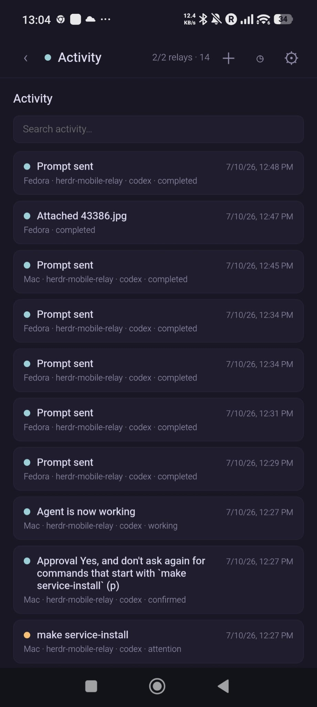

# Herdr Mobile Relay

[](https://github.com/0cv/herdr-mobile-relay/actions/workflows/check.yml)

A remote control for [Herdr](https://herdr.dev) agents on Linux and macOS: use your smartphone to monitor status, answer prompts, build plans, and manage their lifecycle.

**Current version:** `0.8.5`

Each computer runs its own local relay. The phone app connects to those relays directly and merges their agents; there is no central broker and the computers do not connect to each other.

## Screenshots

| Agents                                                                                                            | Terminal                                                                                                                                   |
| ----------------------------------------------------------------------------------------------------------------- | ------------------------------------------------------------------------------------------------------------------------------------------ |
|  |  |

| Start Agent                                                                                                                                        | Plan Questions                                                                                                                              |
| -------------------------------------------------------------------------------------------------------------------------------------------------- | ------------------------------------------------------------------------------------------------------------------------------------------- |
|  |  |

| Activity                                                                                                     | Relay Settings                                                                                     |
| ------------------------------------------------------------------------------------------------------------ | -------------------------------------------------------------------------------------------------- |
|  |  |

| App Preferences                                                                                                                              | Notifications                                                                                        |
| -------------------------------------------------------------------------------------------------------------------------------------------- | ---------------------------------------------------------------------------------------------------- |
|  |  |

> [!IMPORTANT]
> Native Windows is not supported. WSL2 may work but is not tested.

## Quick Start

Requirements: Herdr 0.7.0 or newer, Git, and `curl`.

```bash
herdr plugin install 0cv/herdr-mobile-relay
```

The setup menu normally opens after installation. If it does not, run:

```bash
herdr plugin action invoke setup --plugin herdr-mobile-relay.events
```

Choose **Quick Start**. It installs missing user-level tools with confirmation, starts the relay and phone app, then opens a temporary TryCloudflare tunnel. No Cloudflare account, domain, Python installation, Node.js, or separate web deployment is required.

When the temporary tunnel is ready, choose where its QR should open:

1. **This temporary relay** is the default and simplest option for trying one relay.
2. **An existing installed Herdr app** adds the temporary computer to the same app as other relays.

Then scan the printed QR code or open its complete HTTPS setup link on your phone. Keep the setup pane open; Ctrl-C stops both the relay and the temporary tunnel. A later Quick Start gets a new hostname, so use its new setup link.

The setup link contains the relay token in its URL fragment. The fragment is not sent to the server and is removed after import, but the link and QR code must still be kept private.

See [QUICKSTART.md](QUICKSTART.md) for the short walkthrough and troubleshooting.

## Stable Everyday Setup

Quick tunnels are disposable. For a permanent hostname and a background service, first add a domain to a Cloudflare account. Then open the setup menu and choose **Stable Tunnel**, or run:

```bash
herdr plugin action invoke install-service --plugin herdr-mobile-relay.events
```

The stable wizard:

1. Logs in to Cloudflare when needed.
2. Lets you confirm the dedicated tunnel and `relay-<computer>.<domain>` hostname.
3. Creates or resumes the tunnel and DNS route without overwriting an existing record.
4. Installs a launchd service on macOS or a user-systemd service on Linux.
5. Verifies public DNS, HTTPS, and the relay identity before printing the stable QR code.
6. On the first run, offers this relay as the app origin for a one-relay setup or an existing installed-app address for multi-relay use.

If setup is interrupted or times out, run the exact command it prints. Its private state is resumable and prevents duplicate tunnels.

Run the wizard separately on every computer, with a distinct hostname for each relay. Add every setup link to the same phone app; the app merges them locally.

Useful plugin actions:

```bash
herdr plugin action invoke setup-link --plugin herdr-mobile-relay.events
herdr plugin action invoke status --plugin herdr-mobile-relay.events
herdr plugin action invoke configure-app-deploy --plugin herdr-mobile-relay.events
herdr plugin action invoke stable-teardown --plugin herdr-mobile-relay.events
```

The `setup-link` action safely reprints the private link and QR for the installed stable relay. It follows the configuration recorded in the background service, including services installed from a source checkout.

Teardown is explicit and confirmed. It removes only resources recorded as owned by the wizard. Run it before uninstalling the plugin if you also want the Cloudflare resources removed.

> [!NOTE]
> `make stable-setup` and `make setup-link` are checkout-development commands. Do not use a checkout's `make setup-link` for a marketplace installation whose service uses the plugin configuration; the command intentionally refuses that configuration mismatch.

## What You Can Do

- Merge agents from several computers into one mobile view.
- Approve ordinary permission prompts and answer Claude Code or Codex structured questions.
- View terminal output and send prompts, slash commands with suggestions, terminal keys, screenshots, or photos.
- Start, rename, clear, and stop detected Codex, Claude Code, and OpenCode agents.
- Search relay activity and receive blocked-agent or optional completion notifications.
- Dictate agent prompts via push-to-talk voice input with automatic speech-to-text transcription.
- Require device verification before reconnecting relays.
- Install the app as a PWA on Android or iOS.

## Phone Setup

The QR code adds the relay URL, label, and token automatically. To add one manually, open **Settings** and enter:

- **Relay Name:** a label such as `Mac` or `Fedora`
- **Relay URL:** the relay's `wss://` URL
- **Token:** its `HERDR_RELAY_TOKEN`

Enable notifications from Settings. Blocked-agent notifications are included while push is enabled; completion notifications are optional per device.

To install the PWA, open the HTTPS app in Safari and use **Share → Add to Home Screen**, or use Chrome's **Install app** action. A temporary TryCloudflare hostname is unsuitable for a permanent installation because it changes when restarted.

During guided Stable Tunnel setup, choose **This relay** to use its verified hostname as the phone app, or choose **An existing installed Herdr app** and enter its Site settings domain or URL. You can enter a domain such as `app.example.com`; the wizard adds `https://` automatically and checks for the Herdr app manifest. A temporary reachability failure can be explicitly overridden. The selected origin is shown on later interactive runs and recorded privately beside the relay environment. Later QR codes can then target the same installed app while carrying the selected computer's relay URL in the fragment. There is no shared or built-in app hostname.

An installed PWA also refreshes the private record whenever it connects. If an older relay was removed before either mechanism recorded the installed app origin, provide that origin once when reprinting its checkout QR:

```bash
make setup-link APP_URL=app.example.com
```

Use the HTTPS address shown in the installed app's site settings. After the app reconnects, later `make setup-link` and **Show Phone Setup QR** runs reuse the private record without the override. Android can hand an in-scope link to the installed PWA when supported-link handling is enabled. iOS and iPadOS do not currently capture external links into Safari-installed PWAs; open the installed app and add the relay manually there.

## Updates from the Phone

Version 0.7.0 is the one-time manual bootstrap for phone-driven updates. For a Marketplace installation, run this on each relay computer:

```bash
HERDR_MOBILE_RELAY_NO_AUTO_SETUP=1 herdr plugin install 0cv/herdr-mobile-relay --yes && \
  herdr plugin action invoke install-service --plugin herdr-mobile-relay.events
```

The stable setup follows the configuration recorded by an existing stable service, including one previously installed from a source checkout, then restarts the relay under the Marketplace plugin. To remain checkout-managed instead, run `git pull --ff-only && make service-install` from that checkout. Later versioned releases are checked at relay startup, once per day, and whenever you tap **Settings → Check** for that relay. The same commands are available under **Settings → Update Help** when a connected relay still needs the bootstrap.

An update is offered only when the `main` branch publishes a higher semantic version. The relay pins the advertised Git revision, asks for confirmation, installs that exact revision outside its own service process, restarts, and verifies `/healthz`. A failed verification triggers an automatic rollback.

Marketplace-managed plugins and clean local checkouts on the canonical `main` branch can update automatically. A local checkout with uncommitted changes, another origin, another branch, or no matching stable background service is reported as blocked instead of being modified. Each relay is updated separately.

The **About** card checks both the `version.json` deployed by the app’s current web origin and the committed upstream release. It distinguishes an app that is ready to reload from an origin that has not deployed the upstream bundle yet; an old host is never described as the latest version.

If a relay serves the app origin, a verified relay update publishes the bundled app and reloads it automatically. A separately hosted Cloudflare Pages app needs one computer to own its deployment. On that stable relay, install Node.js 24, authenticate Wrangler as the service user (or configure a narrowly scoped Pages API token), then run:

```bash
herdr plugin action invoke configure-app-deploy --plugin herdr-mobile-relay.events
```

The action verifies the selected Pages project and custom domain, records the exact production branch and local tool paths in the private relay environment, restarts the relay, and offers to publish the current app immediately. That first local deployment bootstraps older installed PWAs that do not have the phone-side Deploy button yet.

For later releases, Settings first asks you to update that deployment-owner relay. **Deploy App** then confirms an exact installed version and Git revision, refuses modified release assets, validates the committed `web/` bundle, deploys only to the configured project and `main` branch, verifies the public `version.json`, and reloads the PWA. Cloudflare credentials never go to the phone. Configure only one deployment owner per app origin to avoid competing releases.

## How It Works

- The Python relay listens on `127.0.0.1:8375`, serves the committed app in `web/`, and accepts authenticated WebSocket connections.
- Cloudflare Tunnel provides the public HTTPS/WSS endpoint without opening an inbound port.
- The Svelte source lives in `frontend/`; phone relay configuration stays in browser local storage.
- The Herdr plugin sends local status-change events to UDP port `8376` so blocked and finished states arrive promptly.
- Runtime data remains local: push state, bounded activity, Claude history, and temporary uploads are kept in the relay's private config or cache directories.

The relay never SSHs into another computer. Each relay invokes only fixed local Herdr operations and exposes only detected supported agent profiles.

## Agent Profiles Configuration

By default the relay detects Codex, Claude Code, and OpenCode. It also automatically advertises any agent installed as a Herdr integration (`herdr integration install qodercli`, for example), so newly integrated agents appear in the phone's Start Agent list without extra configuration. Additional agents (e.g. Pi) can be added with an INI file at `~/.config/herdr/agent-profiles.ini` (respects `$XDG_CONFIG_HOME`).

```ini
[profiles]
codex = Codex
claude = Claude Code
opencode = OpenCode
pi = Pi
```

- Keys in `[profiles]` are **merged** with the built-in defaults. You only need to add new agents or override existing labels.
- Set `[config] replace_profiles = true` to replace instead of merge.
- Each profile id is also its executable name. Its binary must be on `PATH` for the relay to advertise it. A missing user-added binary prints one warning per relay run.

### Custom Slash-Command Suggestions

Claude Code has its own command discovery and Codex uses built-in suggestions. Other profiles need both skill directories and a known command format. Pi's defaults are `~/.pi/agent/skills` and `skill:{name}`, so its sections below are optional:

```ini
[skills]
pi = ~/.pi/agent/skills

[commands]
pi = skill:{name}
```

- Keys match profile ids from `[profiles]`. Directories are scanned for `*/SKILL.md` frontmatter (`name`, `description`, optional `argument-hint`).
- The first configured path is labelled **personal**; subsequent paths are **project**.
- Paths are `:`-separated on macOS and Linux (`os.pathsep`). Directory names containing `:` are not supported.
- A command format must contain exactly one `{name}` placeholder. The relay adds the leading `/`, although a configured leading slash is also accepted.
- Profiles without a built-in or configured command format do not expose skill suggestions. Set a format to `off` or leave it empty to disable suggestions explicitly. Invalid formats print a warning and are disabled instead of interrupting the client connection.
- `user-invocable: false` in frontmatter hides a skill from suggestions.

### Running Agent Identity

The relay remembers the exact profile id for panes it launches, rather than guessing from the agent name reported by Herdr. For agents that were already running or remain alive across a relay restart, add an exact reported-name alias when the Herdr name differs from the profile id:

```ini
[aliases]
pi-coding-agent = pi
```

Pi's alias above is built in. Configured aliases can extend or override built-in aliases. Alias values must name a configured profile; unmatched agent names are not guessed by substring.

### Voice Input

The relay supports push-to-talk voice input. When you tap the microphone button in the terminal composer, the phone records audio (WebM/Opus) and sends it to the relay, which converts it to WAV and submits it to a configured speech-to-text endpoint. The transcribed text is inserted into your prompt composer.

Voice transcription requires an STT endpoint URL in `~/.config/herdr/agent-profiles.ini`:

```ini
[transcribe]
url = https://api.openai.com/v1/audio/transcriptions
api_key = sk-...
model = whisper-1
```

| Setting | Default | Description |
| --------- | --------- | ------------- |
| `url` | *(required)* | OpenAI-compatible STT endpoint URL |
| `api_key` | — | Bearer token sent as `Authorization` header |
| `model` | — | Model name sent as form field (e.g. `whisper-1`) |
| `max_size_mb` | `25` | Maximum upload size in megabytes |
| `timeout_s` | `30` | HTTP request timeout in seconds |

When the STT endpoint returns transcribed text, it is appended to the current composer content. Transcription failures show a toast notification on the phone.

### Hot Reload

Send `SIGHUP` to the relay process to re-read `agent-profiles.ini` without restarting. New client connections receive the updated profile list, and later command-catalog requests use the reloaded skills, formats, and aliases. The phone caches a catalog per agent and working directory, so reconnect or switch directories to refresh a catalog already shown.

## Security

- Treat setup links, QR codes, relay URLs, and tokens as secrets.
- Public WebSocket control requires the relay token; comparisons are constant-time.
- The relay binds to loopback by default and refuses an unauthenticated non-loopback bind.
- Browser origins are checked, uploaded images are limited to 10 MB, and launch requests cannot supply arbitrary executables or shell commands.
- A connected phone can control the Herdr panes exposed by that relay. Remove an unknown relay from Settings and rotate a leaked token immediately.

Rotate a checkout token with `make rotate-token`. To rotate a marketplace installation from a checkout, select its configuration explicitly:

```bash
HERDR_RELAY_ENV="$(herdr plugin config-dir herdr-mobile-relay.events)/relay.env" make rotate-token
```

## Local Checkout

Use a checkout for development or for running without the marketplace plugin:

```bash
git clone https://github.com/0cv/herdr-mobile-relay.git
cd herdr-mobile-relay
make quick-start
```

The checkout stores relay configuration in `relay/.env`.

```bash
make dev-tunnel        # build frontend/dist, then use isolated ports and a temporary tunnel
make stable-setup       # provision/resume a named tunnel and service
make service-status    # inspect the installed service
make service-logs      # follow service logs
make stable-teardown   # remove wizard-owned stable resources
```

If you intentionally manage Cloudflare yourself, set `CLOUDFLARED_CONFIG` in the active relay environment before installing the service. The stable wizard validates and reuses a compatible existing configuration without rewriting it.

`make dev-tunnel` requires Node.js 24, keeps its token and push state under ignored `relay/.dev/`, and never reads the production relay configuration. Keep it in the foreground and press Ctrl-C to stop both the relay and tunnel.

## Development

Backend checks use Python 3.10 or newer. Frontend development is pinned to Node.js 24.

```bash
make backend-check
npm ci --prefix frontend
make frontend-check
make frontend-browser
make check
```

On Fedora, do not use `playwright install-deps`; it attempts to run Ubuntu's `apt-get`. `make frontend-browser` runs Chromium locally and WebKit in Playwright's pinned Podman container.

Normal frontend work builds untracked `frontend/dist/`. Release work alone replaces the committed `web/` bundle:

```bash
make web-release
make web-release-check
```

`make web-deploy` deploys the already committed bundle and never rebuilds it. It targets the `main` production branch by default even when invoked from another local Git branch; use `WEB_BRANCH=<branch>` only for an intentional preview.

## Troubleshooting

- **No setup menu:** invoke the `setup` plugin action shown above.
- **Port 8375 is busy:** stop the earlier quick start or installed service before starting another relay.
- **Temporary link does not open:** keep the Quick Start pane open and rerun it if `cloudflared` exited; every run creates a new hostname.
- **App opens but does not connect:** reopen the complete setup link, including its `#setup=...` fragment.
- **Stable setup stops:** preserve its state and rerun the exact command printed in the error.
- **Need to add the relay to another phone:** choose **Show Phone Setup QR** or invoke the `setup-link` plugin action.
- **Stable hostname already exists:** choose another hostname or remove the unrelated DNS record yourself; the wizard never overwrites it.
- **Need a support snapshot:** run the plugin `status` action.

`GET /health` returns `ok`. `GET /healthz` returns the relay instance, product version, Git revision, and protocol used by the stable wizard, updater, and Settings diagnostics.

## License

Herdr Mobile Relay is licensed under the [GNU Affero General Public License v3.0 or later](LICENSE).
